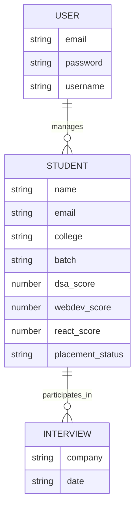

```mermaid


erDiagram
    
    USER ||--o{ STUDENT : manages
    USER {
        string email
        string password
        string username
    }
    STUDENT ||--o{ INTERVIEW : participates_in
    STUDENT {
        string name
        string email
        string college
        string batch
        number dsa_score
        number webdev_score
        number react_score
        string placement_status
    }
    INTERVIEW {
        string company
        string date
    }
```