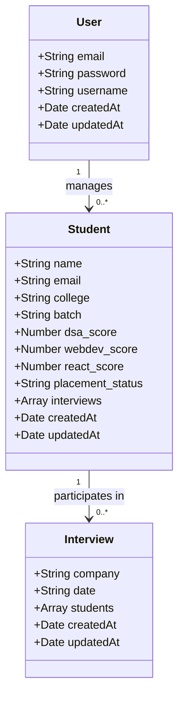

```mermaid


classDiagram
    class User {
        +String email
        +String password
        +String username
        +Date createdAt
        +Date updatedAt
    }
    class Student {
        +String name
        +String email
        +String college
        +String batch
        +Number dsa_score
        +Number webdev_score
        +Number react_score
        +String placement_status
        +Array interviews
        +Date createdAt
        +Date updatedAt
    }
    class Interview {
        +String company
        +String date
        +Array students
        +Date createdAt
        +Date updatedAt
    }
    User "1" --> "0..*" Student: manages
    Student "1" --> "0..*" Interview: participates in
```